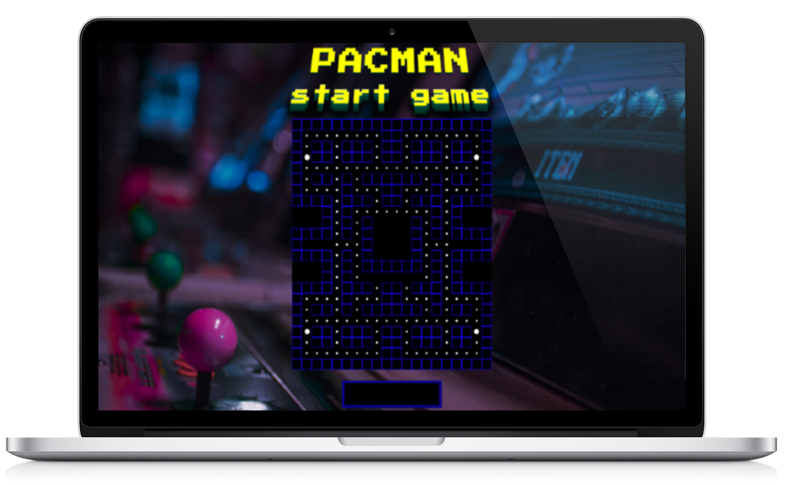

# PACMAN  |  <a href='https://cranky-newton-8d2b10.netlify.app/'>[Live Link]</a>
  

## Table of Contents

- [Overview](#Overview)
- [Tech](#Tech)
- [Design](#Design)
- [Testing](#Testing)
- [Planning](#Planning)
- [Challenges](#Challenges)

 
 

# Overview

This is a clone of the arcade classic Pacman that is built with Vanilla JS. 
Gameplay and movement is controlled by the directional keys (up, down, left, right). 

## Key Features

- Object Oriented Design pattern
- Randomized ghost patterns
- Object collision checks
- Interactive audio

# Tech

### Javascript
Project was built with Javascript to leverage browser's asynchronous Event Loop and DOM event handlers to minimize concurrency and maximize
performance
### CSS
All game pieces and board were custom styled to give game a retro feel. Pacman was animated using CSS keyframes to simulate 'eating'.
### Netlify
This game is hosted with Netlify. Netlify is a serverless cloud deployment experience which makes Continuous Deployment a breeze by connecting to this github repository.
### Parcel
Due to the small project size, Parcel was the perfect choice for a bundler.
